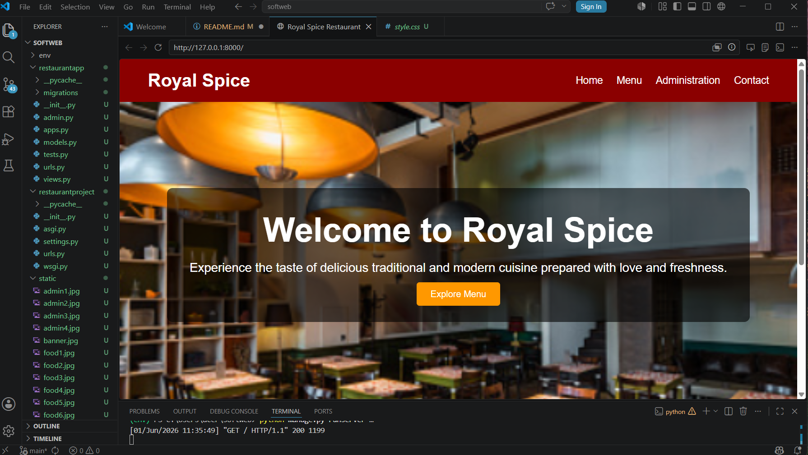
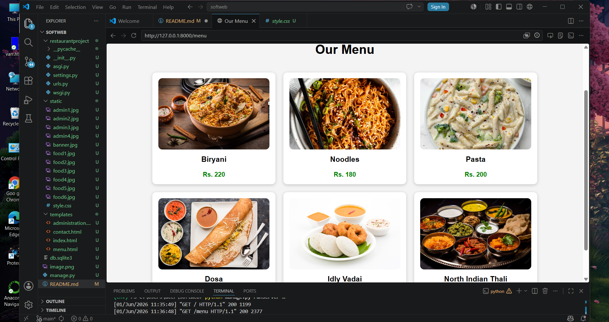
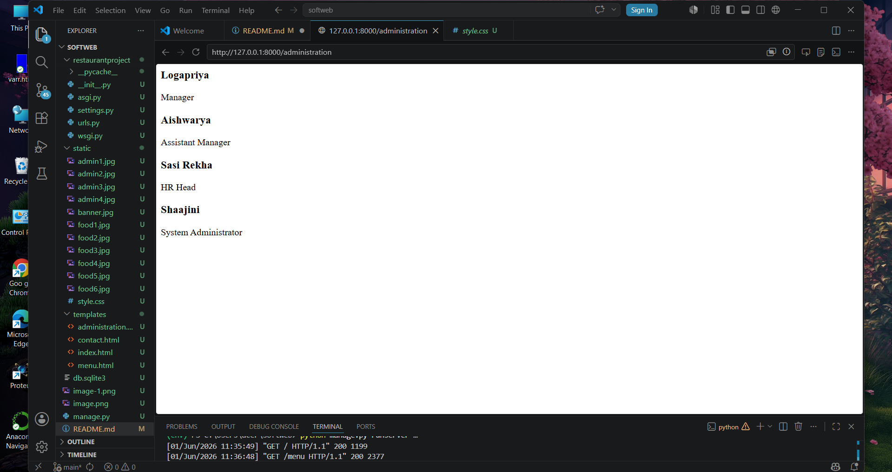
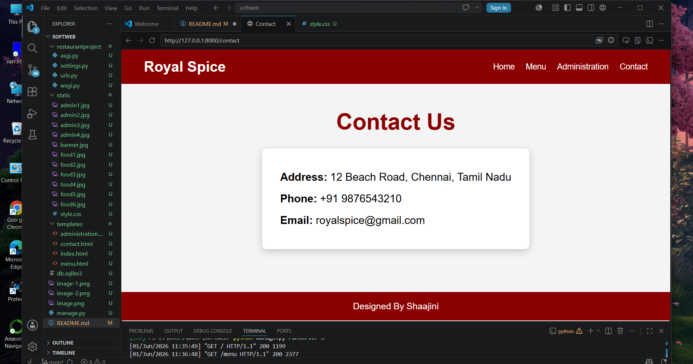

# Ex.06 Restuarant Website
## Date:

## AIM:
To develop a static Resturant website to display the menu and services provided by the resturant.

## DESIGN STEPS:

### Step 1:
Requirement collection.

### Step 2:
Creating the layout using HTML and CSS.

### Step 3:
Updating the sample content.

### Step 4:
Choose the appropriate style and color scheme.

### Step 5:
Validate the layout in various browsers.

### Step 6:
Validate the HTML code.

### Step 7:
Publish the website in the given URL.

## PROGRAM:
menu.html
```
 <!DOCTYPE html> <html lang="en"> <head> <meta charset="UTF-8"> <meta name="viewport" content="width=device-width, initial-scale=1.0"> <title>Our Menu</title>
<style>
    body{
        font-family: Arial, sans-serif;
        margin:0;
        padding:0;
        background:#f4f4f4;
    }

    header{
        background:#333;
        color:white;
        padding:15px;
        text-align:center;
    }

    nav a{
        color:white;
        text-decoration:none;
        margin:0 15px;
    }

    h1{
        text-align:center;
        margin:20px 0;
    }

    .menu-items{
        display:flex;
        flex-wrap:wrap;
        justify-content:center;
        gap:20px;
        padding:20px;
    }

    .menu-item{
        background:white;
        width:280px;
        padding:15px;
        border-radius:10px;
        text-align:center;
        box-shadow:0 2px 8px rgba(0,0,0,0.2);
    }

    .menu-item img{
        width:100%;
        height:180px;
        object-fit:cover;
        border-radius:10px;
    }

    .menu-item h3{
        margin-top:10px;
    }

    .menu-item span{
        font-weight:bold;
        color:green;
    }
</style>
</head> <body> <header> <h1>Royal Spice</h1>
<nav>
    <a href="/">Home</a>
    <a href="/menu">Menu</a>
    <a href="/administration">Administration</a>
    <a href="/contact">Contact</a>
</nav>
</header> <h1>Our Menu</h1> <div class="menu-items">
<div class="menu-item">
    
    <h3>Biryani</h3>
    <span>Rs. 220</span>
</div>

<div class="menu-item">
    
    <h3>Noodles</h3>
    <span>Rs. 180</span>
</div>

<div class="menu-item">
    
    <h3>Pasta</h3>
    <span>Rs. 200</span>
</div>

<div class="menu-item">
    
    <h3>Dosa</h3>
    <span>Rs. 90</span>
</div>

<div class="menu-item">
    
    <h3>Idly Vadai</h3>
    <span>Rs. 80</span>
</div>

<div class="menu-item">
    
    <h3>North Indian Thali</h3>
    <span>Rs. 250</span>
</div>
</div> </body> </html>

.menu-item img{
    width:100%;
    height:120px;
    object-fit:cover;
    border-radius:10px;
}

.menu-item span{
    color:green;
    font-weight:bold;
}
</style>

</head>
<body>
```
administration.html
```
<div class="admin-team">

    <div class="team-member">
        <h3>Logapriya</h3>
        <p>Manager</p>
    </div>

    <div class="team-member">
        <h3>Aishwarya</h3>
        <p>Assistant Manager</p>
    </div>

    <div class="team-member">
        <h3>Sasi Rekha</h3>
        <p>HR Head</p>
    </div>

    <div class="team-member">
        <h3>Shaajini</h3>
        <p>System Administrator</p>
    </div>

</div>
```
contact.html
```


<!DOCTYPE html>
<html lang="en">
<head>
    <meta charset="UTF-8">
    <meta name="viewport" content="width=device-width, initial-scale=1.0">
    <title>Contact</title>

    <link rel="stylesheet" href="">
</head>

<body>

<header>

    <div class="logo">Royal Spice</div>

    <nav>
        <a href="/">Home</a>
        <a href="/menu">Menu</a>
        <a href="/administration">Administration</a>
        <a href="/contact">Contact</a>
    </nav>

</header>

<section class="contact-container">

    <h1>Contact Us</h1>

    <div class="contact-box">

        <p><strong>Address:</strong> 12 Beach Road, Chennai, Tamil Nadu</p>

        <p><strong>Phone:</strong> +91 9876543210</p>

        <p><strong>Email:</strong> royalspice@gmail.com</p>

    </div>

</section>

<footer>

    Designed By Shaajini

</footer>

</body>
</html>
```
style.css
```
body{
    margin:0;
    overflow:hidden;
}

header{
    padding:5px;
}

.logo{
    font-size:18px;
}

.page-title{
    font-size:22px;
    margin:5px 0;
}

.menu-container{
    display:grid;
    grid-template-columns:repeat(3,1fr);
    gap:8px;
    padding:8px;
}

.food-card img{
    height:80px;
}

.food-card h3{
    font-size:14px;
    margin:3px;
}

.food-card span{
    font-size:14px;
}
```

## OUTPUT:




## RESULT:
The program for designing software company website using HTML and CSS is completed successfully.
